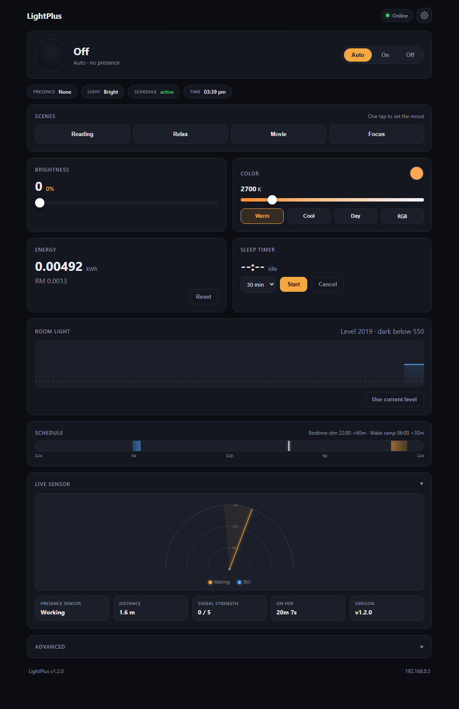

# LightPlus

A presence-aware bedside lamp that turns on only when the room is dark **and** a human is actually in it. Uses mmWave radar to detect stationary people (not just motion), dims gently toward bedtime, ramps up for a wake window, and hosts its own control dashboard — no cloud, no app, no external dependencies.

[](LICENSE)



---

## Hardware

| Component | Role |
|---|---|
| **ESP32** | Main controller — WiFi, logic, web server |
| **LD2410C** | 24 GHz mmWave radar — human presence detection (UART) |
| **LDR** (photoresistor) | Ambient light sensing (ADC voltage divider) |
| **HS-F12A** ring (12× WS2812) | Addressable RGB LED ring, full RGB + tunable white |

### Wiring

| ESP32 Pin | Connected To | Notes |
|---|---|---|
| GPIO 5 | LED ring data line | WS2812 data |
| GPIO 16 | LD2410C TX | Radar TX → ESP32 RX (UART2) |
| GPIO 17 | LD2410C RX | Radar RX → ESP32 TX (UART2) |
| GPIO 4 | LD2410C OUT | Radar output pin (optional) |
| GPIO 34 | LDR voltage divider | ADC1, 12-bit (0–4095) |
| 5V / GND | LED ring power | External supply recommended for full brightness |
| 5V / GND | LD2410C | Radar power |

---

## Features

- **True presence detection** — mmWave radar detects micro-movements (breathing, posture shifts), so a person sitting still won't cause the light to go dark. Unlike PIR, which only sees motion and loses a stationary person within seconds.
- **Automatic brightness & color temperature** — Lamp turns on only when **both** conditions hold: room is dark AND presence is confirmed. Both conditions are debounced to prevent flicker.
- **Circadian scheduling** — Configurable bedtime dim ramp (warm + dim) and wake brightening ramp (cool + bright), with cubic-easing transitions for smooth, natural fades.
- **Self-hosted dashboard** — A dark-themed, responsive SPA served directly from the ESP32 via LittleFS. Open `http://<esp32-ip>/` in any browser on the same WiFi network — no server, no build step, no external CDN.
- **Manual override** — Force On / Force Off / Auto at the press of a button. Override does **not** persist across power cycles (device always boots in Auto mode).
- **WebSocket real-time control** — Bidirectional JSON state broadcast every 2 seconds, plus 11 commands for on-the-fly configuration.
- **OTA firmware updates** — Upload new firmware wirelessly via Arduino IDE or `espota.py`. No USB cable after the first flash.
- **Energy tracking** — Estimates kWh consumption from brightness level and calculates cost at the Malaysian residential tariff rate (RM 0.27/kWh). Persisted to flash every 5 minutes.
- **Radar gate tuning** — Per-gate moving and stationary sensitivity thresholds (0–100) exposed live on the dashboard, so you can exclude reflective objects (TVs, walls) or dial in sensitivity for your space.
- **Sleep timer** — Configurable countdown (1–120 minutes) after which the lamp dims to floor. Cancel anytime.
- **Home Assistant via MQTT** — auto-discovery of a light (on/off, brightness, colour temp, RGB), occupancy, light level, target distance and energy entities — no custom integration needed
- **Captive-portal setup** — if the saved WiFi network is unreachable, the lamp hosts a `LightPlus-Setup` access point with a web setup page; credentials persist in flash
- **Optional access token** — set `WS_TOKEN` to require authentication for control commands
- **Presence behaviour** — configure how long the light lingers after you leave, and whether it fades to a night-light glow instead of switching off
- **Dashboard languages** — English / Bahasa Malaysia

---

## How It Works

```
lamp_should_be_on = is_dark AND presence_confirmed
```

### Sensor pipeline

1. **LDR** — Sampled every 200 ms on ADC1 (12-bit, 0–4095). An 8-sample rolling average smooths out transient shadows and passing clouds.
2. **LD2410C radar** — Polled every 50 ms via UART2. Three consecutive positive reads are required before presence is confirmed (debounce window of 3), filtering out sensor noise.
3. **Combined decision** — When both `is_dark` (LDR reading < configured threshold) and `presence_confirmed` (moving or stationary) are true, the lamp activates.

### Schedule and dimming

Scheduling is **duration-based**: each window is defined as "start at HH:MM, run for N seconds." This avoids the midnight-crossing bug that plagues start/end clock-time comparisons.

| Time period | Behavior |
|---|---|
| **Wake window** (e.g. 06:00 for 30 min) | Brightness ramps 10 → 255 (cubic ease-out), CCT ramps 2200K → 5000K |
| **Bedtime window** (e.g. 22:00 for 60 min) | Brightness ramps 255 → 10 (cubic ease-in), CCT ramps 2700K → 2200K |
| **Gap** (after bedtime ramp finishes, before wake ramp starts) | DIM_FLOOR (brightness 10, 2200K) |
| **Daytime** (dark + presence, but no active window) | FULL_BRIGHTNESS (255, 2700K) |
| **Room bright or no presence** | Off (brightness 0) |

### Manual override

Sits on top of all automatic logic:

- **Force On** — Lamp on at manual brightness/CCT or RGB color, regardless of sensors or schedule.
- **Force Off** — Lamp off, regardless of sensors or schedule.
- **Auto** — Resume automatic behavior.

Override state is volatile — a power cycle always returns to Auto mode, so the lamp cannot get stuck in a forced state after an outage.

### LED driver

- CCT-to-RGB uses the **Tanner Helland approximation** (also replicated in dashboard JS for accurate color previews).
- Supports both CCT mode (2000–6500K) and full RGB mode.
- FastLED drives the ring at ~30 FPS (33 ms interval).

### Energy estimation

```
kWh += (brightness / 255) × 0.003 W × (33 ms / 3,600,000 ms)
```

Accumulated every LED refresh cycle when brightness > 0. Saved to NVS every 5 minutes. Reset-able from the dashboard. Cost displayed in Malaysian Ringgit at RM 0.27/kWh.

---

## Design Rationale

### Why mmWave radar instead of PIR?

PIR (passive infrared) sensors only detect **changes** in infrared radiation. A person sitting still — reading, working, watching TV — fades from a PIR's view within seconds, and the lamp goes dark. This is worse than useless for a bedside or desk lamp.

The LD2410C is a 24 GHz mmWave radar that detects micro-movements: breathing, heartbeats, subtle posture adjustments. It distinguishes between **stationary** (someone present but still) and **moving** targets, and reports both independently. The lamp uses either signal to confirm presence, so a reader in a chair keeps their light.

### Why duration-based scheduling instead of start/end times?

A wake window of "23:00 to 01:00" cannot be expressed as a simple `start < now < end` comparison — it wraps around midnight, and naive comparisons break. Duration-based scheduling ("start at 23:00, run for 120 minutes") works cleanly with modular arithmetic on the 86400-second day and is immune to midnight crossings.

### Why debouncing?

The LDR uses an 8-sample rolling average, and the radar uses a 3-sample confirmation window. Without these, transient events — a cloud passing over a skylight, a sensor spike — would cause flickering or false triggers. Debouncing costs a few hundred milliseconds of latency but eliminates an entire class of embarrassing real-world bugs.

### Why self-hosted (LittleFS)?

The dashboard is a single HTML file with embedded CSS and JS, served from the ESP32's flash. This means:
- No separate server, no build step, no CDN, no internet dependency
- `http://<esp32-ip>/` just works from any browser on the same WiFi
- No npm, no `node_modules`, no framework churn
- Fits in a 128 KB LittleFS partition alongside the firmware

### Why does the manual override not survive a power cycle?

If Force Off persisted across reboots, a power outage would leave the lamp permanently off with no obvious way to turn it back on (the dashboard requires the ESP32 to be running and connected). Volatile override means the device always comes back in a known-good default state.

---

## File Structure

```
iotlamp/
├── iotlamp.ino           # Main firmware: sensors, logic, LED driver, WebSocket, OTA
├── config.h / config.cpp # RuntimeConfig struct, NVS load/save, validation
├── pins.h                # GPIO pin assignments and timing constants
├── state.h               # LampMode, Presence enums, LampState struct
├── logic.h               # Pure schedule/easing/kelvin logic (host-testable)
├── wifi_config.h         # WiFi credentials (gitignored — not in repo)
├── wifi_config.h.example # Template — copy to wifi_config.h and fill in
├── data/                 # Web app (uploaded to LittleFS)
│   ├── index.html        #   Dashboard shell
│   ├── app.css           #   Design system / styles
│   ├── app.js            #   WebSocket client + UI logic
│   ├── manifest.webmanifest  # PWA manifest
│   ├── sw.js             #   Service worker (offline app shell)
│   ├── icon-*.png        #   App icons (192/512/maskable)
│   └── logo.png          #   Optional brand logo (see Branding & Logos)
├── lib/MyLD2410/         # Vendored radar library (used by CI, reference copy)
├── tests/
│   └── logic_test.cpp    # Host unit tests for logic.h (run in CI)
├── docs/
│   ├── HARDWARE.md       # Wiring, power notes, BOM and cost options
│   └── INTEGRATIONS.md   # Home Assistant / HomeKit / Matter plan
├── tools/
│   ├── test_ws.mjs       # End-to-end WebSocket test suite
│   └── README.md         # Tool usage
├── .github/workflows/ci.yml       # Compile check + host tests
├── .github/workflows/release.yml  # Tagged release artifacts
├── littlefs.bin          # Generated LittleFS image (gitignored; see tools/README)
├── CHANGELOG.md
├── ROADMAP.md
├── CONTRIBUTING.md
├── SECURITY.md
├── LICENSE               # MIT
└── README.md             # This file
```

---

## Getting Started

### 1. Hardware wiring

Connect components according to the [wiring table](#wiring) above.

### 2. Configure WiFi

```bash
cp wifi_config.h.example wifi_config.h
```

Edit `wifi_config.h` with your credentials and timezone:

```cpp
const char *WIFI_SSID     = "YourWiFi";
const char *WIFI_PASSWORD = "YourPassword";
const long  GMT_OFFSET_SEC = 28800;  // UTC+8 (Malaysia); adjust for your timezone
```

### 3. Install Arduino IDE libraries

Install these via the **Library Manager** (Sketch → Include Library → Manage Libraries):

| Library | Purpose |
|---|---|
| **FastLED** (by Daniel Garcia) | WS2812 LED control |
| **ESPAsyncWebServer** (by lacamera) | HTTP + WebSocket server |
| **AsyncTCP** (by lacamera) | TCP foundation for ESPAsyncWebServer |
| **ArduinoJson** (by Benoit Blanchon) | JSON parsing and generation |
| **ArduinoOTA** | Over-the-air firmware updates (bundled with ESP32 core) |
| **Preferences** | Non-volatile storage (bundled with ESP32 core) |
| **LittleFS** | Flash filesystem (bundled with ESP32 core) |
| **MyLD2410** | Custom library for LD2410C radar — [GitHub link](https://github.com/) |

> `MyLD2410` is vendored under [`lib/MyLD2410`](lib/MyLD2410) so CI builds and reference copies work out of the box. For local Arduino builds, also install it into your Arduino libraries folder.

### 4. Configure ESP32 partition scheme

Select a partition scheme with two OTA app partitions and a LittleFS data partition:
- **Tools → Partition Scheme → Minimal SPIFFS (1.9MB APP with OTA/190KB SPIFFS)**
- Or create a custom partition table with at least 128 KB for `spiffs`/`littlefs`.

### 5. Upload

1. **Upload the LittleFS data** — Tools → ESP32 Sketch Data Upload. This writes everything in `data/` (dashboard app, PWA assets, icons) to the flash filesystem.
2. **Compile and upload** the sketch via USB.

After the first USB upload, all future firmware updates can be done over WiFi via OTA (see below).

### 6. Connect to the dashboard

Open `http://<esp32-ip>/` in any browser on the same WiFi network. The dashboard auto-connects via WebSocket.

> **Tip:** Find the ESP32's IP from the Arduino Serial Monitor (115200 baud). It logs IP, NTP sync, and sensor status on boot.

---

## Dashboard


The dashboard is a single-page application with:

- **LED Status** — live ON/OFF/FORCED indicator, presence type (moving/stationary/none), dark/bright state, NTP sync status
- **Override buttons** — Auto / Force On / Force Off with optimistic UI updates
- **Brightness slider** — percentage fill bar with 200 ms debounce
- **Color Temperature** — slider (2000–6500K), live swatch, three CCT presets (Warm 2700K, Cool 4000K, Day 5000K), custom RGB color picker
- **Power & cost** — estimated kWh, cost in MYR, current wattage, reset button
- **Sleep timer** — dropdown (15/30/45/60 min), Start/Cancel, live countdown
- **LDR calibration** — canvas-based rolling chart, live reading, threshold indicator, one-click "Set to Current"
- **Schedule config** — bedtime dim and wake ramp: start time + duration
- **Gate sensitivity** — LD2410C per-gate moving and stationary thresholds (0–100)
- **Command log** — color-coded last 20 events (sent / received / error)

---

## Install as an app (PWA)

The dashboard is an installable web app. On Android Chrome (or desktop Chrome/Edge), open the dashboard and use **Install app** / **Add to Home screen** — it then launches fullscreen with its own icon, and keeps working from cache if the device is briefly unreachable.

> Browsers only allow PWA installation on secure origins. A plain `http://<esp32-ip>` LAN address normally can't offer it; for a demo you can enable `chrome://flags/#unsafely-treat-insecure-origin-as-secure` and add the device URL, or serve the dashboard behind HTTPS.

---

## Branding & Logos

Branding is centralized so it is easy to change:

- **Name** — search for `LightPlus` in `dashboard.html`, `iotlamp.ino` (boot banner), and this README.
- **Logo** — drop your image as `data/logo.png` (square or wide, ~28-56 px tall recommended), then re-upload the filesystem (Tools → ESP32 Sketch Data Upload). The dashboard header picks it up automatically and falls back to the LightPlus wordmark when no logo file is present.
- **Different filename/format** — edit the `src` of the `#brandLogo` image in `dashboard.html` (e.g. `logo.svg`), copy the file into `data/`, and re-upload the filesystem.

---

## Home Assistant (MQTT)

The lamp speaks MQTT with Home Assistant auto-discovery. Steps:

1. Have an MQTT broker (e.g. the **Mosquitto** add-on in Home Assistant).
2. Open the dashboard → **Settings** → **MQTT (Home Assistant)**, enable it, enter
   the broker host/port (and username/password if required), then **Save MQTT**.
3. Home Assistant discovers the device automatically; entities appear under
   **LightPlus**: light (on/off, brightness, colour temperature, RGB), occupancy,
   light level, target distance and energy.

Topics (device id from the MAC; shown in the dashboard state broadcast):

| Topic | Direction | Purpose |
|---|---|---|
| `lightplus/<id>/ha/state` | device → broker | HA light state (retained) |
| `lightplus/<id>/ha/set` | broker → device | HA light commands, or native `{"cmd":...}` |
| `lightplus/<id>/state` | device → broker | full runtime state (for Node-RED etc.) |
| `lightplus/<id>/availability` | device → broker | `online` / `offline` (LWT) |
| `homeassistant/<component>/<id>_<name>/config` | device → broker | discovery payloads |

A test tool lives at [`tools/mqtt_test.py`](tools/mqtt_test.py).

---

## WebSocket API

WebSocket endpoint: `ws://<esp32-ip>/ws`

### Commands (client → server)

Each command is a JSON object with a `"cmd"` field.

| Command | Parameters | Description |
|---|---|---|
| `set_bedtime` | `start_h` (0–23), `start_m` (0–59), `duration_s` (1–43200) | Set bedtime dim window |
| `set_wake` | `start_h` (0–23), `start_m` (0–59), `duration_s` (1–43200) | Set wake brightening window |
| `set_dark_threshold` | `value` (0–4095) | Set LDR dark threshold |
| `override` | `mode`: `"auto"`, `"force_on"`, `"force_off"` | Set lamp mode |
| `set_brightness` | `value` (0–255) | Manual brightness |
| `set_cct` | `value` (2000–6500) | Manual color temperature (Kelvin) |
| `set_rgb` | `r`, `g`, `b` (0–255 each) | Manual RGB color |
| `start_sleep_timer` | `minutes` (1–120) | Start sleep countdown |
| `cancel_sleep_timer` | — | Cancel active sleep timer |
| `set_gate_params` | `gate` (0–8), `moving` (0–100), `stationary` (0–100) | Set LD2410C gate sensitivity thresholds |
| `reset_energy` | — | Reset kWh counter to zero |
| `set_presence` | `hold_s` (1–300), `lost`: `"off"` or `"dim"` | Presence hold time and night-light behaviour |
| `set_mqtt` | `enabled` (0/1), `host`, `port`, `user`?, `pass`? | Configure MQTT broker (omit user/pass to keep existing) |

All commands return `{"result":"ok","cmd":"<command>"}` on success or `{"error":"<message>"}` on failure.

If `WS_TOKEN` is set in `wifi_config.h`, clients must first send `{"cmd":"auth","token":"<token>"}`; other commands are rejected with `{"error":"unauthorized"}` until authenticated. The state broadcast remains readable.

### State broadcast (server → client, every 2 seconds)

```json
{
  "dark": true,
  "presence": "stationary",
  "mode": "auto",
  "brightness": 255,
  "cct": 2700,
  "dark_threshold": 550,
  "ldr_raw": 312,
  "energy_kwh": 0.001234,
  "cost_myr": 0.000333,
  "color_src": "cct",
  "rgb_r": 0,
  "rgb_g": 0,
  "rgb_b": 0,
  "sleep_timer_s": 0,
  "uptime_s": 3600,
  "in_window": true,
  "timestamp": 1699999999
}
```

| Field | Type | Description |
|---|---|---|
| `dark` | bool | Whether ambient light is below threshold |
| `presence` | string | `"none"`, `"moving"`, or `"stationary"` |
| `mode` | string | `"auto"`, `"force_on"`, or `"force_off"` |
| `brightness` | uint | Current output brightness (0–255) |
| `cct` | uint | Current color temperature in Kelvin (2200–5000) |
| `dark_threshold` | uint | Configured LDR threshold (0–4095) |
| `ldr_raw` | uint | Current LDR ADC reading (0–4095) |
| `energy_kwh` | float | Estimated cumulative energy consumption |
| `cost_myr` | float | Estimated cost at RM 0.27/kWh |
| `color_src` | string | `"cct"` or `"rgb"` — active color mode |
| `rgb_r/g/b` | uint | RGB values when in RGB mode (0 otherwise) |
| `sleep_timer_s` | uint | Remaining sleep timer seconds (0 if inactive) |
| `uptime_s` | uint | Device uptime in seconds |
| `in_window` | bool | Whether current time is inside a schedule window |
| `timestamp` | uint | Unix epoch (0 if NTP not yet synced) |
| `fw` | string | Firmware version |
| `bs_h` / `bs_m` / `bs_d` | uint | Bedtime start hour/minute and duration (s) |
| `ws_h` / `ws_m` / `ws_d` | uint | Wake start hour/minute and duration (s) |
| `ph_s` / `pl_act` | uint | Presence hold seconds, lost action (0 = off, 1 = night light) |
| `id` | string | Device id (from MAC, e.g. `lpb9c9fc`) — used in MQTT topics |
| `mqtt_en` / `mqtt_on` | bool | MQTT enabled / connected |
| `mqtt_host` / `mqtt_port` | string/uint | Configured broker (credentials never broadcast) |
| `ldr_fault` | bool | Light sensor reading looks invalid (open/short) |
| `ap` | bool | Setup access point is active |
| `radar_ok` | bool | Radar data stream healthy |
| `radar_status` | uint | 0 none, 1 moving, 2 stationary, 3 both, 255 invalid |
| `radar_mdist` / `radar_sdist` | uint | Target distances (cm) |
| `radar_msig` / `radar_ssig` | uint | Target signal strength (0–100) |

---

## Configuration Reference

All runtime settings are persisted to the ESP32's NVS (non-volatile storage) and survive power cycles. Default values are applied on first boot or after a config version mismatch.

| Setting | NVS Key | Default | Range | Description |
|---|---|---|---|---|
| Bedtime start hour | `bs_h` | 22 | 0–23 | Hour bedtime dimming begins |
| Bedtime start minute | `bs_m` | 0 | 0–59 | Minute bedtime dimming begins |
| Bedtime duration | `bs_dur` | 3600 | 1–43200 | Dim ramp duration (seconds) |
| Wake start hour | `ws_h` | 6 | 0–23 | Hour wake ramp begins |
| Wake start minute | `ws_m` | 0 | 0–59 | Minute wake ramp begins |
| Wake duration | `ws_dur` | 1800 | 1–43200 | Wake ramp duration (seconds) |
| Dark threshold | `dark` | 550 | 0–4095 | LDR reading below which room is "dark" |

All settings can be changed live via the dashboard or WebSocket commands.

---

## OTA Firmware Updates

After the initial USB upload, firmware can be updated wirelessly.

**Hostname:** `lightplus`
**OTA password:** `your_ota_password` (set in `wifi_config.h`)

### Via Arduino IDE

- **Tools → Port** — Select the network port for your ESP32 (e.g., `lightplus at 192.168.x.x`)
- Upload as normal — the IDE compiles and pushes over WiFi.

### Via command line

```bash
espota.py -i <esp32-ip> -p 3232 --auth=your_ota_password -f firmware.bin
```

The OTA handler uses a 120-second timeout (longer than the Arduino IDE default) to accommodate the flash write phase without dropping the connection.

---

## Testing

An end-to-end WebSocket test suite lives in [`tools/test_ws.mjs`](tools/test_ws.mjs). With a device on the network:

```bash
node tools/test_ws.mjs 192.168.0.6
```

It checks HTTP serving, the state broadcast, every command's validation path, and reversible write commands (restoring device state afterwards). It exits non-zero on failure.

## Continuous Integration

[`.github/workflows/ci.yml`](.github/workflows/ci.yml) compiles the firmware on every push and pull request using the ESP32 Arduino core, the public libraries, and the vendored `MyLD2410` copy.

## Documentation

| Document | Contents |
|---|---|
| [`docs/HARDWARE.md`](docs/HARDWARE.md) | Wiring, power notes, BOM and cost-cutting options |
| [`docs/INTEGRATIONS.md`](docs/INTEGRATIONS.md) | Home Assistant / HomeKit / Matter integration plan |
| [`ROADMAP.md`](ROADMAP.md) | What's done and what's next |
| [`CHANGELOG.md`](CHANGELOG.md) | Release history |

## License

[MIT](LICENSE)
